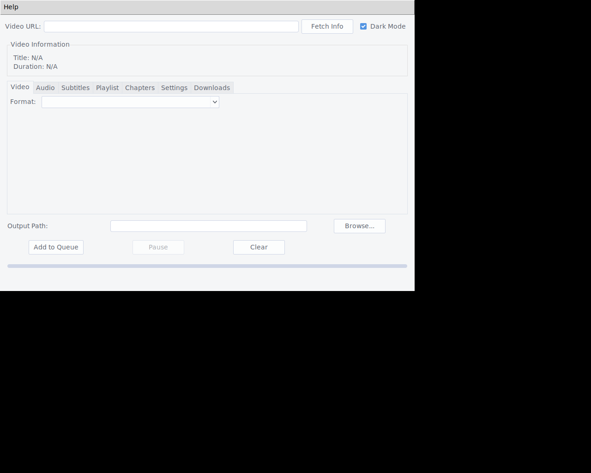
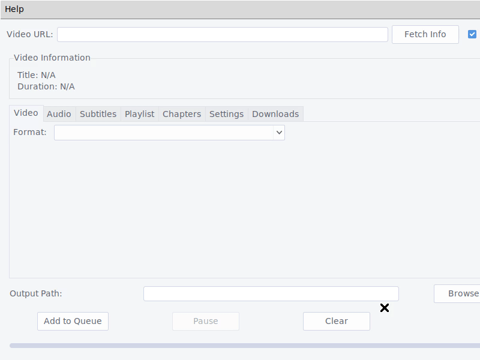

# YTDownloader

YTDownloader is a modern, user-friendly desktop application for downloading videos and subtitles from YouTube. Built with Python, Tkinter, and the powerful `yt-dlp` library, it offers a seamless and feature-rich experience for all your video downloading needs.

## Features

- **Modern & Intuitive UI**: A clean and stylish interface with a modern theme and layout.
- **Download Queue**: Queue multiple videos for download and manage them with ease.
- **Pause, Resume, and Cancel Downloads**: Pause, resume, or cancel your downloads at any time.
- **Enhanced Download Queue**: View detailed information about your downloads, including file size, download speed, and ETA.
- **Detailed Format Selection**: Choose from a wide range of video and audio formats with detailed information, including codecs, bitrate, and file size.
- **Chapter Splitting**: Split videos into chapters for easier navigation.
- **Configurable Settings**: Configure a proxy and set a download speed limit to manage your network usage.
- **Tabbed Layout**: A well-organized, tabbed interface that separates video, audio, subtitle, and playlist options for a streamlined user experience.
- **Fetch Video Information**: Instantly fetch and display video details, including the title, thumbnail, and duration, before you download.
- **High-Quality Downloads**: Download videos in the highest available quality, or choose from a variety of video and audio formats.
- **Playlist Support**: Download entire playlists with a single click.
- **Subtitle & Transcript Downloads**: Download subtitles and transcripts in various formats (SRT, VTT, etc.) and languages (when available).
- **Custom Output Path**: Choose exactly where you want to save your downloaded files.
- **Real-Time Progress**: A visual progress bar keeps you informed of your download's status in real-time.
- **Clear UI**: A "Clear" button that resets the UI to its initial state, allowing you to easily start a new download.
- **Standalone Executable**: The application is packaged as a single executable file, so you don't need to install Python or any dependencies to use it.

## User Walkthrough

Here’s a step-by-step guide to using YTDownloader:

1.  **Enter a Video URL**: Paste the URL of the YouTube video or playlist you want to download into the "Video URL" field.

2.  **Fetch Video Info**: Click the "Fetch Info" button to see the video's title, thumbnail, and duration, as well as a list of available video, audio, and subtitle options.

3.  **Select Your Options**:
    *   **Video Tab**: Choose your desired video format from the dropdown menu. You'll see detailed information about each format, including the resolution, FPS, codecs, and file size.
    *   **Audio Tab**: Choose your desired audio format from the dropdown menu, with details like bitrate, codec, and file size.
    *   **Subtitles Tab**: If subtitles are available, select your preferred language and format.
    *   **Playlist Tab**: If you entered a playlist URL, check the "Download Playlist" box to download the entire playlist.
    *   **Chapters Tab**: Check the "Split Chapters" box to split the video into chapters.
    *   **Settings Tab**: Configure a proxy and download speed limit.

4.  **Choose an Output Path**: Click the "Browse..." button to select the folder where you want to save your download. If you don't choose a path, the file will be saved in the same directory as the application.

5.  **Start the Download**: Click the "Add to Queue" button to add the video to the download queue. The download will start automatically.

6.  **Manage Your Downloads**:
    *   **Pause/Resume/Cancel**: Use the "Pause," "Resume," and "Cancel" buttons to control your downloads.
    *   **Downloads Tab**: Switch to the "Downloads" tab to see a detailed view of your download queue, including the file size, download speed, and ETA.
    *   **Context Menu**: Right-click on a download in the "Downloads" tab to open a context menu with options to cancel, remove the download from the queue, or open the file's location.

7.  **Clear the UI**: When you're finished, click the "Clear" button to reset the UI and prepare for a new download.

## Installation

You can download the latest version of YTDownloader as a standalone executable from the project's releases page. No installation is required—just download the file and run it.

## Building from Source

If you prefer to build the application from the source code, follow these steps:

1.  **Clone the Repository**:
    ```bash
    git clone https://github.com/your-username/ytdownloader.git
    cd ytdownloader
    ```

2.  **Create a Virtual Environment**:
    ```bash
    python -m venv venv
    source venv/bin/activate  # On Windows, use `venv\Scripts\activate`
    ```

3.  **Install Dependencies**:
    ```bash
    pip install -r requirements.txt
    ```

4.  **Run the Application**:
    ```bash
    python main.py
    ```

5.  **Build the Executable**:
    To create a standalone executable, run the following command:
    ```bash
    pyinstaller --onefile --windowed --noconsole main.py
    ```
    The executable will be located in the `dist` directory.

## Screenshots

*A new screenshot will be added soon to reflect the latest UI improvements.*



## GIF of the Application in Action

*A new GIF will be added soon to reflect the latest UI improvements.*



## Contributing

Contributions are welcome! If you have any ideas for new features or improvements, feel free to open an issue or submit a pull request.
