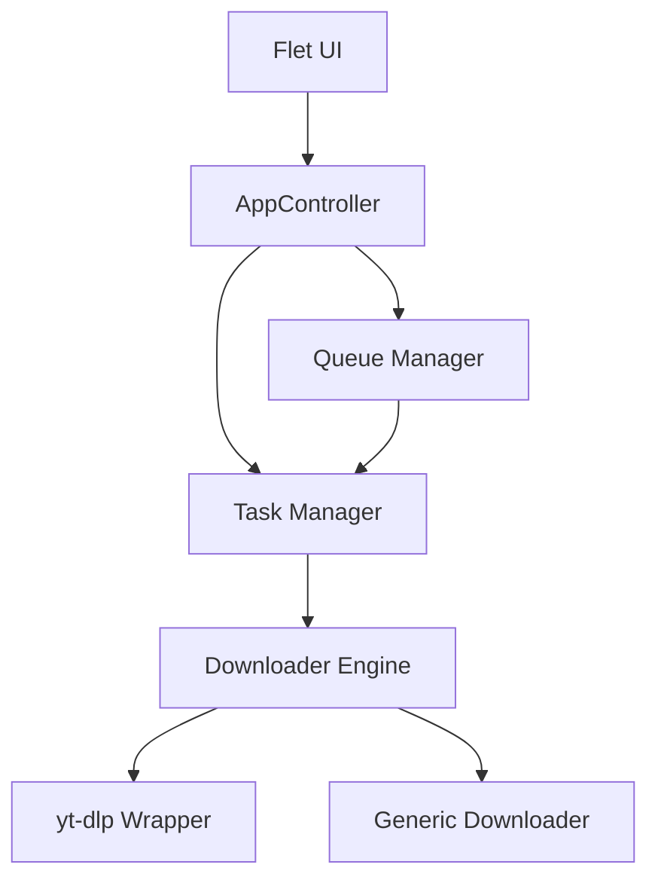

# Architecture Overview

StreamCatch follows a modular, event-driven architecture built with Python and Flet.

## High-Level Diagram

## Key Components

### 1. AppController (`app_controller.py`)
The central coordinator. It initializes the UI, manages global state, and handles user interactions. It delegates tasks to specific managers.

### 2. UI Layer (`views/`)
Built using Flet. It uses a component-based approach:
*   **Views**: High-level pages (e.g., `DownloadView`, `QueueView`).
*   **Components**: Reusable widgets (e.g., `DownloadItemControl`, `Panels`).
*   **Theme**: Centralized styling in `theme.py`.

### 3. Task Management (`tasks.py`)
Handles background processing using `ThreadPoolExecutor`. It manages concurrency, ensuring the UI remains responsive while downloads happen in the background.

### 4. Downloader Engine (`downloader/`)
A robust package handling the actual download logic.
*   **Core**: Main entry point (`download_video`).
*   **Engines**: Specific implementations for different backends (yt-dlp, generic HTTP).
*   **Extractors**: Metadata extraction logic.

### 5. State Management
*   **AppState**: A singleton holding global configuration and runtime state.
*   **QueueManager**: Manages the list of downloads, their status, and persistence.
*   **HistoryManager**: Logs completed downloads to a SQLite database.

## Data Flow

1.  User enters a URL in `DownloadView`.
2.  `AppController` triggers a metadata fetch via `tasks_extended.fetch_info_task`.
3.  Metadata is displayed. User configures options and clicks "Download".
4.  Item is added to `QueueManager`.
5.  `tasks.process_queue` picks up the item and submits it to the `ThreadPoolExecutor`.
6.  `download_task` executes, calling `downloader.core.download_video`.
7.  Progress is reported back via callbacks, updating the UI in real-time.
