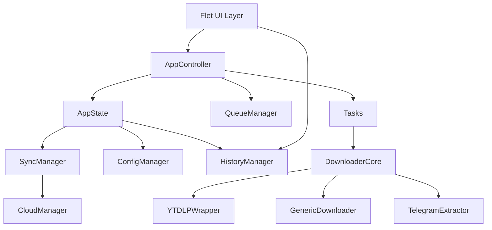

# Architecture Overview

StreamCatch is a modular, event-driven desktop/mobile application built around a clear split between UI orchestration, queue/state management, and download execution engines.

## High-Level Topology

## Runtime Layers

### 1. Presentation Layer (`views/`, `app_layout.py`, `ui_manager.py`)

- Implements all screens and shared controls using Flet.
- `UIManager` instantiates views and handles navigation/index synchronization.
- `AppLayout` switches between desktop rail and mobile bottom-navigation behavior.

### 2. Orchestration Layer (`app_controller.py`, `tasks.py`)

- `AppController` handles user-intent callbacks and delegates to services/managers.
- Background queue loop runs separately from UI thread and processes scheduled items.
- `tasks.py` owns download job execution, concurrency control, and queue submission.

### 3. Domain and State Layer (`app_state.py`, managers)

- `AppState` is a process-wide singleton containing config, queue, history, and feature state.
- `QueueManager` provides thread-safe queue mutation, lifecycle transitions, and cancellation.
- `HistoryManager` stores immutable download outcomes in SQLite (WAL-enabled).

### 4. Download Engine Layer (`downloader/`)

- `downloader.core.download_video()` is the primary execution entrypoint.
- Strategy selection:
  - Telegram URL -> `TelegramExtractor`
  - Forced generic or unsupported URL -> `GenericDownloader`
  - Otherwise -> `YTDLPWrapper`
- Safety checks include output path sanitization, template constraints, and disk-space guardrails.

### 5. Integration Layer (`sync_manager.py`, `cloud_manager.py`, `rss_manager.py`)

- `SyncManager` exports/imports config+history with zip-slip protections.
- `CloudManager` currently supports Google Drive integration (PyDrive2).
- RSS feed manager drives watch-style ingestion into the queue.

## Queue Lifecycle

Supported status progression:

- `Queued -> Allocating -> Downloading -> Processing -> Completed`
- `Queued -> Allocating -> Downloading -> Error`
- `Queued/Allocating/Downloading/Processing -> Cancelled`
- `Scheduled -> Queued` when schedule condition is met
- `Queued -> Paused -> Queued`

## Threading Model

- UI work executes on Flet/UI context.
- Download jobs run in `ThreadPoolExecutor` workers.
- Queue coordination uses locks + condition variable (`wait_for_items`).
- Cancellation uses token registration per active item.

## Packaging and Deployment Architecture

- Desktop native packaging uses Nuitka (`scripts/build_installer.py`).
- Mobile packaging uses Flet/Flutter (`scripts/build_mobile.py`).
- GitHub workflows produce verified artifacts and release attachments.
